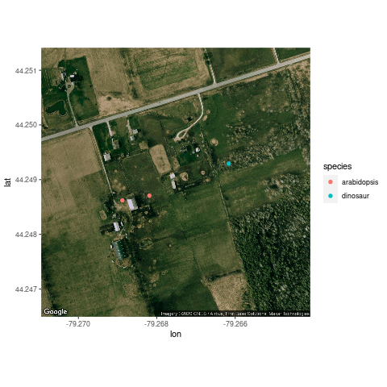

# Local-species-catalogue
Part of agriculture framework project

*2020-10-12* Originally conceptualized during Agritechathon-2020 (Oct 9-11), and branched with a diverse team to create a service offering. The pitch and project files will be available when released by the organizers.

Agritech project - A farmer needs to know what's around their fields, in terms of species and insects. The species may be known or unknown to them. Using plant image recognition API, we aim to create a map of plant observations around a farmer's plot, while having control of information.

Get images of plant (insect species too) species with geolocations, and use this R backended system to create a time series map. 

